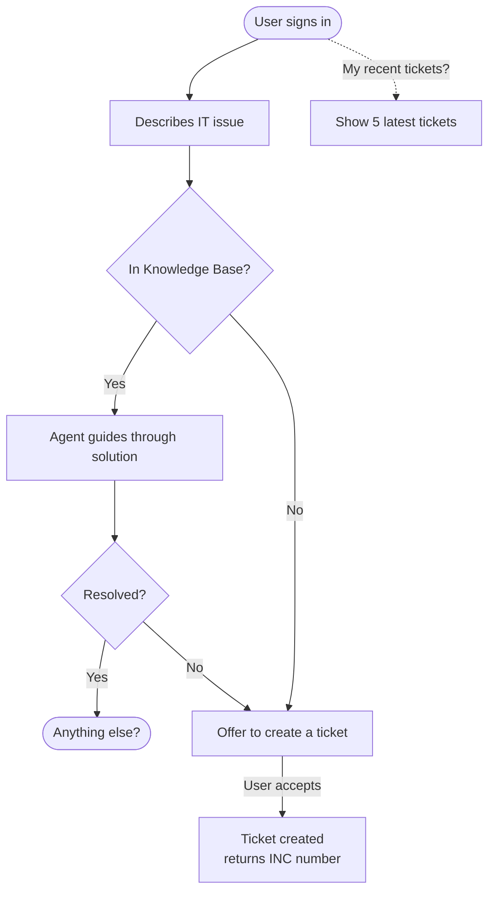
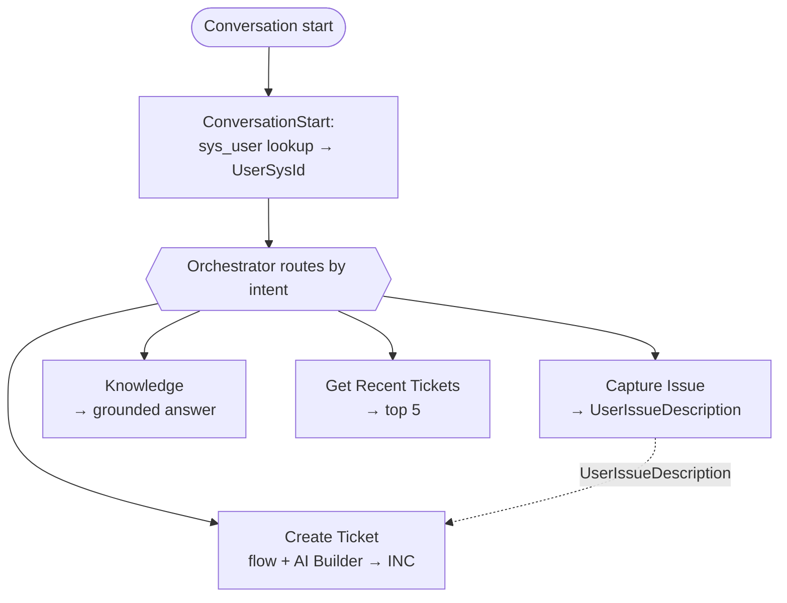
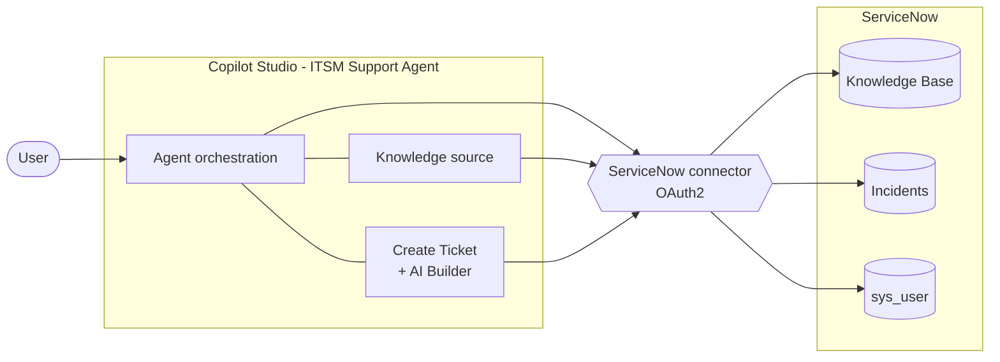
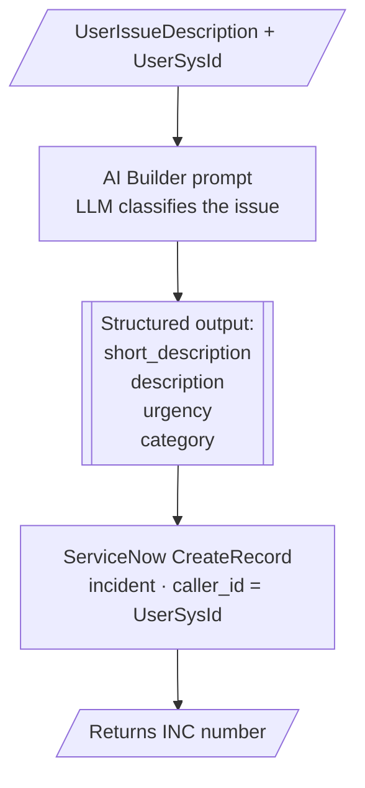

# Schema — 365 ITSM Copilot

## User journey

## Agent flow (topics)

Routing is **generative orchestration** — the agent follows its instructions and chooses the topic; this is not a hard-wired switch.

## Technical architecture

**Notes**
- On start, the agent looks up the user in `sys_user` (by M365 email) → stores `sys_id` as `caller_id`.
- Ticket creation runs a Power Automate flow: **AI Builder** turns the free-text issue into `short_description`, `description`, `urgency`, `category`, then creates the incident.
- Recent tickets = ServiceNow query on `incident` filtered by `caller_id`, newest first, top 5.

## Ticket creation flow

The `CreateServiceNowIncident` Power Automate flow turns the user's free-text issue into a structured incident.

